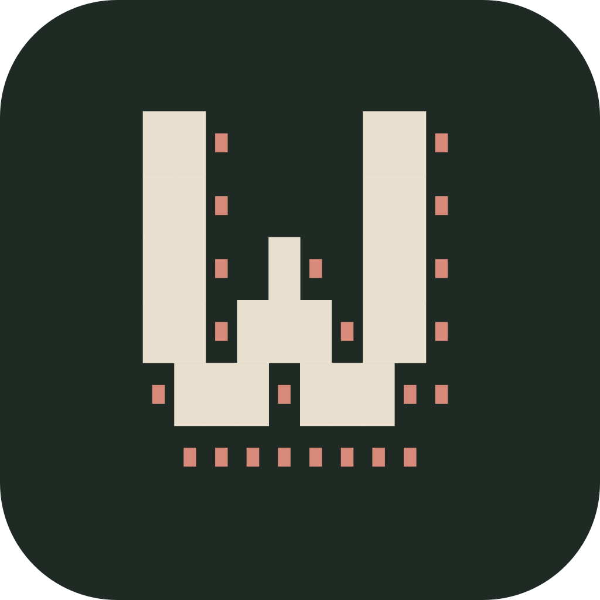

<h3>taag-wordmarks</h3>

<p>
  <sub>1,342 TAAG FONTS, ONE WORD AT A TIME</sub>
  <br>
  <strong>Type a word and flip through every TAAG font in the terminal, recoloured from your own palette.</strong>
  <br>
  <br>
  <a href="https://github.com/morris-frank/taag-wordmarks/actions/workflows/ci.yml"></a>
  
  
  
  
</p>

<br clear="left">

```sh
python3 <(curl -fsSL https://raw.githubusercontent.com/morris-frank/taag-wordmarks/main/wordmarks.py)
```

That one line runs it with nothing installed. The first run downloads the 2.7 MB glyph
dataset into `~/.cache/taag-wordmarks/` and writes a config to
`~/.config/taag-wordmarks/config.toml`. It needs Python 3.11 or newer and a truecolour
terminal; macOS's bundled `/usr/bin/python3` is 3.9, so use a Homebrew, mise or uv Python.

## Keys

The wordmark sits in the middle of the screen, with its index above and the font's name,
section and colour style below.

| Key | Does |
|---|---|
| `↑` `↓` | previous / next font |
| `PgUp` `PgDn` | 20 fonts back / forward |
| `[` `]` | previous / next section (Featured, Regular, ANSI, AOL, TOIlet, TheDraw) |
| `←` `→` | previous / next colour style |
| `Tab` | next theme (dark, light) |
| `a`–`z`, `A`–`Z`, `Space` | type into the word; Shift gives capitals |
| `Backspace` | delete the last letter |
| `Ctrl-Y` | copy the wordmark as plain text |
| `Ctrl-A` | copy it with its truecolour escapes, for a shell banner |
| `Esc` | quit |

Copying uses `pbcopy`, `wl-copy`, `xclip`, `xsel` or `clip.exe`, whichever exists, and
otherwise OSC 52, which most terminals honour even over SSH. About 1,066 fonts have no
lowercase of their own, so there `maurice` and `MAURICE` look the same.

## Options

```sh
python3 wordmarks.py [WORD] [--font NAME] [--theme NAME] [--config PATH]
```

`WORD` overrides the config's `word` (default `maurice`). `--font` starts on a font by
exact name, ignoring case.

## Configuration

The config is created on first run with the Soilytix design system as its palette, and
is read on every start. Delete it to get the defaults back.

| Key | Default | Holds |
|---|---|---|
| `word` | `maurice` | the starting word |
| `theme` | `dark` | the starting theme; `Tab` cycles `[themes]` in file order |
| `[themes.<name>]` | `dark`, `light` | `page` (background) and `muted` (labels) |
| `[colors]` | lime, ink, soil, gold, azure, rose | named colours: `"#RRGGBB"`, or `{ dark = "…", light = "…" }` per theme |
| `[[styles]]` | six styles | what `←` `→` cycles, in file order |

Each style has a `name` and a `kind`:

| `kind` | Fields | Paints |
|---|---|---|
| `solid` | `color` | every glyph character in one colour |
| `vgrad` | `from`, `to` | a top-to-bottom blend, one colour per row |
| `ansi-hue` | `families`, `neutral` | colour fonts: each ANSI colour takes the family colour nearest in hue; greys take `neutral`. Shade is kept by blending from the page, so bright and dim parts stay apart. |
| `ansi-ramp` | `color` | colour fonts: every ANSI colour on one ramp, by lightness |
| `ansi-original` | none | colour fonts: the font's own 16 colours, as VGA RGB |

The `ansi-*` styles appear only on colour fonts. Plain fonts cycle the rest.

## Dataset

`data/` holds the capture the TUI reads: every font's A–Z, a–z and space glyphs as one
gzip JSON bundle, plus the raw FIGlet and TheDraw font files TAAG loads. `data/README.md`
describes the format, the compose rules and what they reproduce.

## Development

Needs mise. Everything else comes from `mise.toml`.

```sh
git clone https://github.com/morris-frank/taag-wordmarks && cd taag-wordmarks
mise run setup   # toolchain, hooks, verify
mise run run     # the TUI, from the clone's data/
```

`mise run check` is the definition of done and is what CI runs. `AGENTS.md` is the
working agreement.
